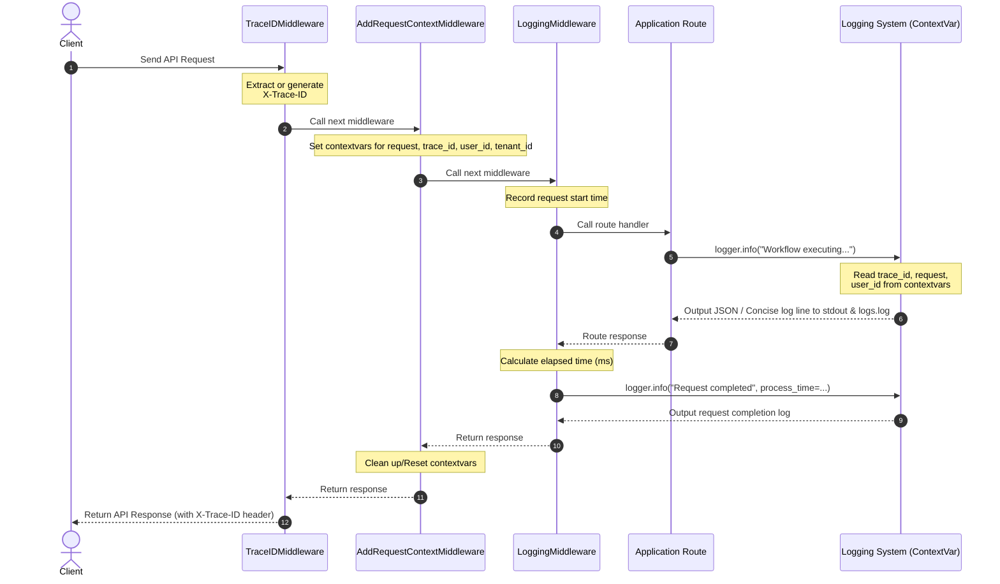

# FastAPI + LangGraph Workflow Orchestration Template   <a href="https://deepwiki.com/samirpatil2000/agentic-template"></a>


A starter template for building AI-driven workflow orchestration systems using FastAPI and LangGraph. This project provides a modular foundation with state management, persistence, and REST APIs so you can quickly prototype and extend your own workflows.


## Features

- FastAPI-based REST API endpoints for workflow management
- LangGraph integration for AI workflow orchestration
- Modular, extensible workflow architecture
- Built-in state management and checkpointing
- PostgreSQL-backed workflow persistence
- Support for workflow interrupts and continuations
- Non-blocking concurrent workflow execution using ThreadPoolExecutor
- LLM response validation and retry utilities with LiteLLM integration
- Added langfuse for observability and tracing
- Structured JSON and concise text logging with 20MB log file rotation

## Prerequisites
- Python 3.11 or higher
- PostgreSQL database

## Installation

1. Clone the repository:
```bash
git clone <repository-url>
cd agentic-template
```

2. Install dependencies:
```bash
pip install -r requirements.txt
```

3. Set up environment variables:
- Copy the example environment file:
```bash
cp .env.example .env
```
- Update values in `.env` to match your local setup (database URL, host, port, etc.).

## Usage

1. Start the server:
- Default port (8000):
```bash
uvicorn app:app --reload
```
- Custom port:
```bash
uvicorn app:app --reload --port 8080
```
- Using environment variables (defined in `.env`):
```bash
uvicorn app:app --reload --port $PORT --host $HOST
```

## Logging

The project includes a production-ready, context-aware logging setup. Logs are outputted to both standard output and a rotating log file (`logs/logs.log`) which automatically rotates at 20MB, keeping up to 3 backups.

### Log Formatting Modes
Configure the output format in your `.env` file using the `CONCISE_LOGGING` variable:

* **Structured JSON Mode** (`CONCISE_LOGGING=false`): Default mode that outputs single-line JSON logs containing log levels, ISO timestamps, platform flags, trace IDs, tenant/user IDs, and request attributes.
* **Concise Mode** (`CONCISE_LOGGING=true`): Pipe-separated, human-readable layout optimized for console readability during local development.

### Logging Architecture & Request Flow

The system uses standard Python logging combined with FastAPI middlewares and thread/async-safe `contextvars` to enrich logs with request metadata automatically.

#### Request Execution Flow



#### Core Components

1. **ContextVars**: Storage for thread-safe and asynchronous task-local values (like the current FastAPI Request, Trace ID, User ID, and Tenant ID). This ensures that any log statement executed during an active request has access to the request's context, without having to pass the request object around.
2. **Custom Formatter (`ContextLoggingFormatter`)**: Serializes log output either into machine-readable JSON strings for production monitoring (indexing fields like `traceId`, `userId`, `tenantId`, `path`, etc.) or pipe-separated strings for local development.
3. **Custom Logger (`CustomLogger`)**: Extends standard logging to support cosmos-style direct keyword arguments (`process_time`, `status_code`, etc.) on log calls (e.g. `logger.info("message", process_time=...)`).
4. **Middlewares Stack**:
   - `TraceIDMiddleware`: Extracts or creates `X-Trace-ID` and writes it to the response header.
   - `AddRequestContextMiddleware`: Pulls context parameters and binds them to `ContextVars` (with clean-up reset handling in a `finally` block).
   - `LoggingMiddleware`: Logs request start/completion events, measures processing latency, and records body payloads in case of uncaught errors.

# 🧩 API Endpoints

#### `GET /`
**Description:**  
Retrieve API information and a list of available endpoints.

**Response Example:**
```json
{
  "version": "1.0",
  "endpoints": [
    "/workflows/{workflow_name}",
    "/workflows/{workflow_name}/{thread_id}"
  ]
}
```

---

#### `POST /workflows/{workflow_name}`
**Description:**  
Start a new workflow.

**Request Body:**
```json
{
  "content": "{\"company_url\": \"https://www.github.com/\"}",
  "type": "text",
  "role": "user"
}
```

**Response Example:**
```json
{
  "thread_id": "abc123",
  "status": "started",
  "workflow_name": "example_workflow"
}
```

---

#### `POST /workflows/{workflow_name}/{thread_id}`
**Description:**  
Continue an existing workflow.

**Request Body:**
```json
{
  "content": "{\"company_url\": \"https://www.github.com/\"}",
  "type": "text",
  "role": "user"
}
```

**Response Example:**
```json
{
  "thread_id": "abc123",
  "status": "in_progress",
  "message": "Workflow updated successfully"
}
```

---

#### `GET /workflows/{workflow_name}/{thread_id}`
**Description:**  
Retrieve the current state of a workflow thread.

**Response Example:**
```json
{
  "thread_id": "abc123",
  "workflow_name": "example_workflow",
  "status": "completed",
  "result": {
    "summary": "Workflow execution finished successfully"
  }
}
```

## Roadmap

Planned features and improvements:

- [x] Add logging and log rotation in file
- [ ] Add authentication
- [ ] Add Prometheus metrics
- [ ] Add tool calling example
- [ ] Add rate limiting
- [ ] Replace sample agent with production-ready agent/chatbot (e.g., email agent)

## Notes

- This repository is a template intended for customization. Replace example workflows, models, and configuration with your own domain logic.
- Consider adding authentication, rate limiting, and observability for production deployments.
